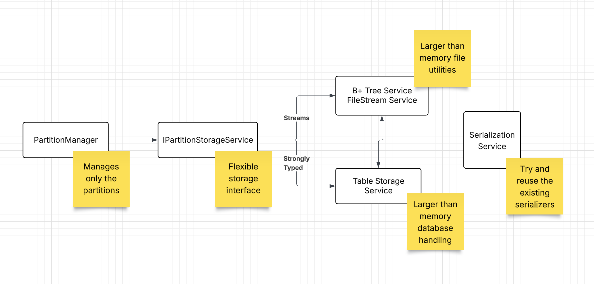

# RFC: Create deticated services that handles stream and serializing

**Status:** Proposed
**Author(s):** AMA
**Date:** 2025-10-05

<!---Human--->
## 1. Summary
Now `BPlusTreePartitioningStrategy` and especially `PartitionManager` are a mix of: serialization, stream manipulationa and their respective functions. We need to thin those services by providing higher level other new services that will take the responsibility of them.

<!---Human--->
## 2. Motivation
The change decouples `BPlusTreePartitioningStrategy` and `PartitionManager` and only makes them responsible for their respective functions.

<!---AI/Human--->
## 3. High-Level Design
We need to introduce two new concepts as services:
- Serialization: Service for both indexing and data in `PartitionManager` (it will be reused from both)
- Stream manipulation: Service that will be responsible putting a data structure into a file and do the pointer management.

Then we need to use those services in `PartitionManager` to manage strongly typed structures. The partition manager would after this know nothing about streams. It would just request from the new service to save/load/enumerate partitions.

The high level design should match the following:

The point of these changes is to be easy to redirect `PartitionManager` to another medium, using streams or not.
This is a very complex tasks and the specs need to be made in very small increments.
The proposed workflow would be:
- Decouple PartitionManager to only work on the partitions, but don't manage or write/read from a medium itself
- Move the partition manager I/O to another class with a well defined interface `IPartitionStorageService` that would encapsulate all I/O actions
- A developer using this library should be able to redirect the implementation to a table storage/db with existing index, or in a filestream storage with a B+ Tree implementation as we have it in the project.
- The serializer service should be reused

Note that the table storage integration is an example and we shouldn't implement this now.

We also need to update the unit tests with these changes, so some specs need to be added for adding and refactoring unit tests.

The task is really big so many small increments should be considered.

<!---AI/Human--->
## 4. Alternatives Considered 
<!---
Describe other solutions or approaches that were considered and explain why they were not chosen. This shows a thorough thought process.
It should look like this:
- **[Alternative A]:** [Description and why it was rejected.]
- **[Alternative B]:** [Description and why it was rejected.]
--->
No alternatives have been considered.

<!---AI--->
## Implementation Specs
<!---
This section is to be filled out by the AI.
The AI should provide a high-level breakdown of the implementation steps. Each step or phase should eventually be detailed in its own implementation spec file (`CodeAssistantSpecsFormat.md`).
It should look like this:
- [ ] `$/specs/file_1_.md`: `Description`
- [ ] `$/specs/file_2_.md`: `Description`
--->
- [ ] `$/features/refactoring-of-streams-to-be-handled-by-special-service-specs/01-create-partition-serialization-service.md`: Extract stream serialization logic into a dedicated, reusable `IPartitionSerializationService`.
- [ ] `$/features/refactoring-of-streams-to-be-handled-by-special-service-specs/02-define-partition-storage-interface.md`: Define the high-level `IPartitionStorageService` interface abstracting storage mechanisms.
- [ ] `$/features/refactoring-of-streams-to-be-handled-by-special-service-specs/03-implement-bplustree-storage-service.md`: Create the `BPlusTreePartitionStorageService` that implements `IPartitionStorageService` managing underlying stream logic.
- [ ] `$/features/refactoring-of-streams-to-be-handled-by-special-service-specs/04-refactor-partition-manager.md`: Refactor `PartitionManager` to consume the new `IPartitionStorageService` and strip out pointer/stream logic.
- [ ] `$/features/refactoring-of-streams-to-be-handled-by-special-service-specs/05-update-tests-and-showcase.md`: Update DI extensions, unit tests, and showcase projects to align with the new decoupled architecture.